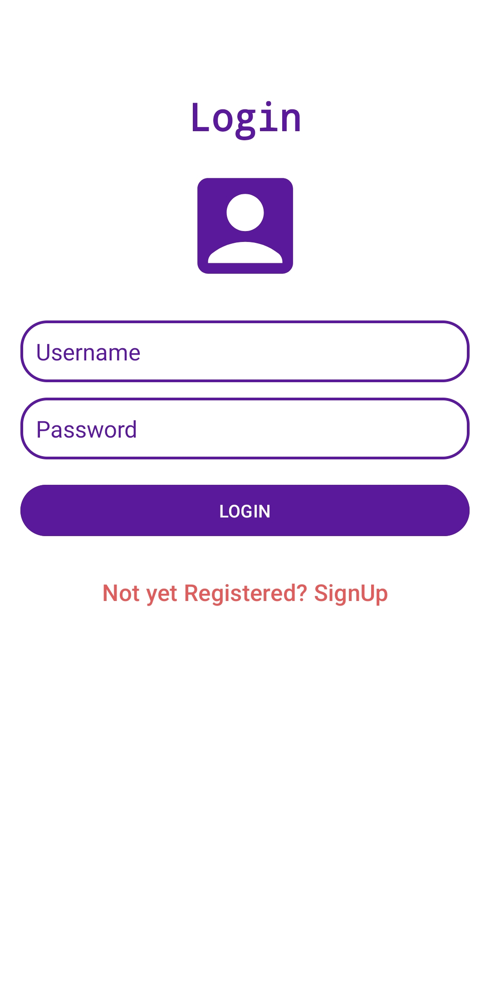
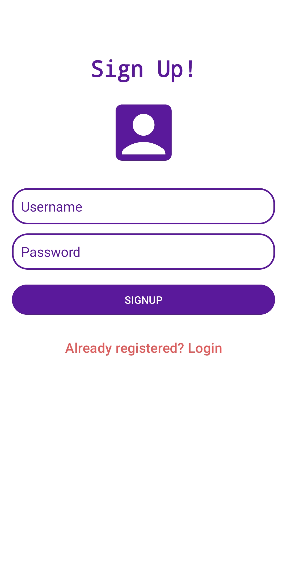

## Aplicativo de Tela de Login e SignUp
### Exemplo de Login e Cadastro usando SQLite

#### Banco de Dados usando SQLite Helper com as funções de :  
- Criar a tabela
- Inserir um usuário
- Verificar se o usuário está na tabela

#### Para acessar a tabela:  
- Baixe o plugin **Simple SQLite Browser**
- Conecte o celular que está sendo usado para o debug via USB ou utilize o emulador
- Pesquise por **Device Explorer** no Android Studio
- Navegue até: data -> data -> ache o nome do seu projeto (ex: com.example.projetosqlite) -> databases -> UserDatabase.db
- Em Table, selecione a tablela "data"
  
Seguindo esses passos vai aparecer as colunas da tabela e os usuários cadastrados.
  

  
  
  

